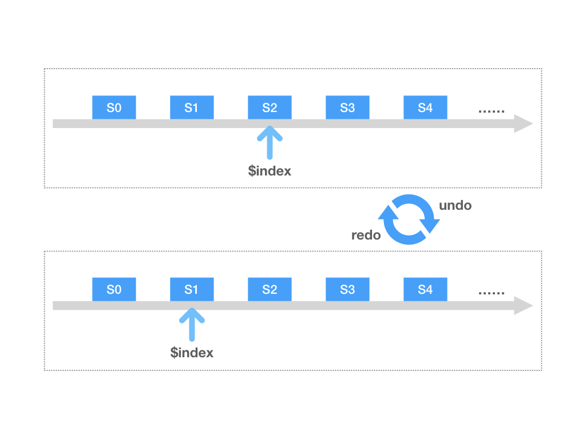

# StateShot
💾 Non-aggressive history state management with structure sharing.

<p>
  <a href="https://travis-ci.org/doodlewind/stateshot">
    
  </a>
  <a href='https://coveralls.io/github/doodlewind/stateshot?branch=master'>
    
  </a>
  <a href="https://unpkg.com/stateshot/dist/stateshot.min.js">
    
  </a>
  <a href="https://standardjs.com">
    
  </a>
  <a href="./package.json">
    
  </a>
</p>


> Just push your states into StateShot and `undo` / `redo` them!


## Getting Started

Install via NPM:

```bash
npm i stateshot
```

Basic usage:

```js
import { History } from 'stateshot'

const state = { a: 1, b: 2 }

const history = new History()
history.pushSync(state) // the terser `history.push` API is async

state.a = 2 // mutation!
history.pushSync(state)

history.get() // { a: 2, b: 2 }
history.undo().get() // { a: 1, b: 2 }
history.redo().get() // { a: 2, b: 2 }
```

## Concepts
For history state management, the top need is the `undo` / `redo` API. That's what StateShot provides out of the box, which can be simply described in image below:



Trivial, right? While in real world projects, the price on saving full state is high. Immutable data structure is known to be suitable for this, since it can share data structure in different references. However, this requires fully adaptation to immutable libs - can be aggressive indeed.

StateShot supports sharable data structure under its tiny API surface. The core concept is to serialize state node into chunks, computing chunks' hash and share same space if hash meets:


Besides the flexible rule-based transforming StateShot supports, it also provides another low-hanging fruit optimization for SPA apps. Suppose your root state is composed of multi "pages", editing on one page does not affect other pages. In this case computing hash on full state is inefficient. As a solution, you can simply specify a `pickIndex` on pushing new state, telling the lib which page to record:


With this hint, only the affected child's hash will be re-computed. Other children simply remains the same with previous record.


## API

### `History`
`new History(options?: Options)`

Main class for state management, option includes:

* `rules` - Optional rules array for optimizing data transforming.
* `delay` - Debounce time for `push` in milliseconds, `50` by default.
* `maxLength` - Max length saving history states, `100` by default.
* `useChunks` - Whether serializing state data into chunks. `true` by default.

> If you want to use StateShot with immutable data, simply set `useChunks` to `false` and new reference to state will be directly saved as records.

#### `push`
`(state: State, pickIndex?: number) => Promise<History>`

Push state data into history, using `pushSync` under the hood. `state` doesn't have to be JSON serializable since you can define rules to parse it.

If `pickIndex` is specified, only this index of state's child will be serialized. Other children will be copied from previous record. This optimization only happens if previous records exists.

#### `pushSync`
`(state: State, pickIndex?: number) => History`

Push state into history stack immediately. `pickIndex` also supported.

#### `undo`
`() => History`

Undo a record if possible, supports chaining, e.g., `undo().undo().get()`.

#### `redo`
`() => History`

Redo a record if possible, also supports chaining,

#### `hasUndo`
`boolean`

Whether current state has undo records before.

#### `hasRedo`
`boolean`

Whether current state has redo records after.

#### `length`
`number`

Valid record length of current instance.

#### `get`
`() => State`

Pull out a history state from records.

#### `reset`
`() => History`

Clear internal data structure.


### `Rule`
`{ match: function, toRecord: function, fromRecord: function }`

By defining rules you can specify how to transform between states and internal "chunks". Chunks are used for structure sharing.

> Rules are only designed for optimization. You don't have to learn or use them unless you've encountered performance bottleneck.

#### `match`
`node: StateNode => boolean`

Defines whether a rule can be matched. For example, if you're saving a vDOM state with different `type` field, just define some rules like `node => node.type === 'image'` or `node => node.type === 'text'`.

#### `toRecord`
`StateNode => { chunks: Chunks, children: Children }`

For matched node, `chunks` is the serializable data we transform it into, and `children` picks out its children for further traversing (By default we traverse the `children` field in each state node, you can customize this behavior by providing code like `children: node.elements` or so). Usually one chunk per node is enough, but you can split a node into multi chunks in this manner:

```js
const state = {
  type: 'container',
  children: [
    { type: 'image', left: 100, top: 100, image: 'foo' },
    { type: 'image', left: 200, top: 200, image: 'bar' },
    { type: 'image', left: 300, top: 300, image: 'baz' }
  ]
}

// Suppose `image` is a heavy field, we can split this field as a chunk.
const toRecord = node => ({
  chunks: [
    { ...node, image: null },
    node.image
  ]
})
```

#### `fromRecord`
`{ chunks: Chunks, children: Children } => StateNode`

Parse the chunks back into the state node. For case before:

```js
// Recover state node from multi chunks.
const fromRecord = ({ chunks, children }) => ({
  ...chunks[0],
  image: chunks[1]
})

const rule = {
  match: ({ type }) => type === 'image',
  toRecord,
  fromRecord
}
```
